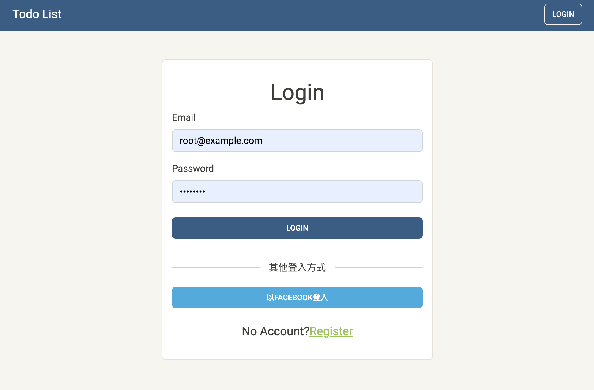
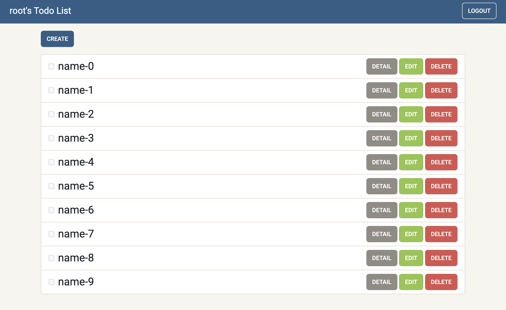

# README




---
## **功能**

- 註冊、登入(email or FB)、登出
- 瀏覽所有 Todo
- 新增 Todo
- 編輯 Todo
- 刪除 Todo

---
## **開發工具**

- Node.js 16.17.1
- Express 4.17.1
- Express-Handlebars 4.0.4
- Express-Session 1.17.1
- passport 0.4.1
- sequelize 5.21.13
- sequelize-cli 5.5.1
- bcryptjs 2.4.3
- connect-flash 0.1.1
- Bootstrap 5.0.2

## **使用資料庫**
- SQL

---
## **執行專案**
請先確認有安裝 node.js、npm、nodemon

1. 將專案 clone 到本地
2. 在本地開啟，輸入：
    ``` bash
    npm install
    ```
3. 透過終端機進入資料夾，輸入：
    ``` bash
    npm run dev
    ```
4. 看見此訊息則代表順利運行：
    ``` bash
    App is running on https://localhost:3000
    mongodb connecting!
    ```
5. 瀏覽器輸入上方網址
6. 欲停止運行：ctrl + c

